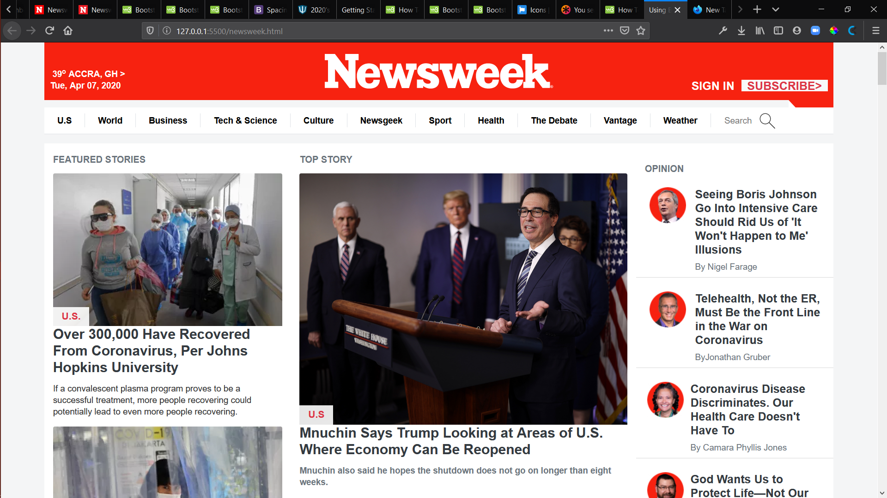

## Table of Contents

- [Table of Contents](#Table-of-contents)
- [Project Name](#Using-Bootstrap)
- [About The Project](#About-the-project)
- [Built With](#Built-with)
- [Live version](#Live-version)                                                            
- [Getting Started](#Getting-Started)                                                            
- [Prerequisite](#Prerequisite)                                                            
- [Setup](#Setup)                                                            
- [Installation](#Installation)                                                            
- [Usage](#Usage)                                                            
- [Run tests](#Run-tests)                                                            
- [Deployment](#Deployment)                                                            
- [Authors](#Authors)                                                                                                                     
- [Contributing](#contributing)
- [Show Your Support](#Show-your-support)
- [Contributing](#contributing)
- [Acknowledgements](#acknowledgements)
- [📝 License](#%f0%9f%93%9d-license)

## Project Name 
- Using Bootstrap

## About The Project

> This project is a replica of the popular news site Newsweek.com. As part of the Microverse HTML and CSS Curriculum, students are supposed to rebuild Newsweek.com website using the Bootstrap framework.This project is for educational purpose only!

You can find the original project specification at: [Odin project curriculum](https://www.theodinproject.com/courses/html5-and-css3/lessons/Newsweek)

## Built With

- HTML,
- CSS,
- Bootstrap,
- VsCode,
- Stylelint,
- Stickler,
- W3 HTML VALIDATOR.

## Live Demo

[Live Demo Link](https://raw.githack.com/JelilFaisalAbudu/using-bootstrap/tree/development)

## Getting Started

- Get a local copy up and running on your machine.
- Modify this file to match your project, remove sections that don't apply.
  For example: delete the testing section if the currect project doesn't require testing.

### Prerequisites

### Setup

### Installation

### Usage

### Run tests

### Deployment

## Authors

👤 Jelil Faisal Abudu

- Github: [@githubhandle](https://github.com/JelilFaisalAbudu)
- Twitter: [@twitterhandle](https://twitter.com/twitterhandle)
- Linkedin: [linkedin](https://linkedin.com/linkedinhandle)

## 🤝 Contributing

Contributions, issues and feature requests are welcome!

Feel free to check the [issues page](https://github.com/JelilFaisalAbudu/using-bootstrap/issues).

## Show your support

Give a ⭐️ if you like this project!

## Acknowledgments

- [Newsweek](https://www.newsweek.com/)
- [Bootstrap](https://getbootstrap.com)

## 📝 License

This project is [MIT](lic.url) licensed.
